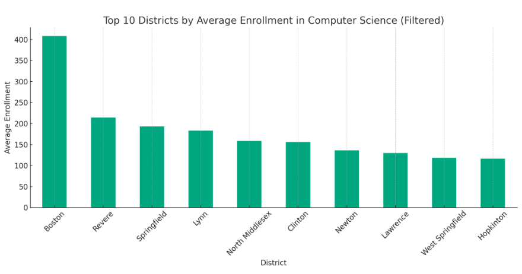
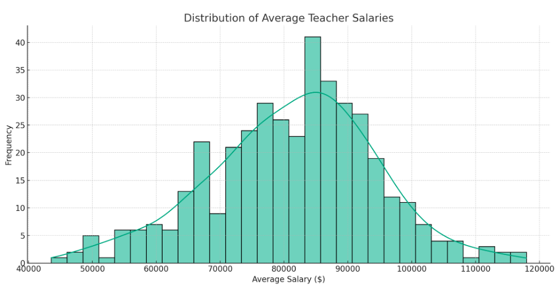

# Massachusetts High School Computer Science Education Analysis

## Team Members
- **Changxuan Fan**, Team Lead - [fanchx@bu.edu](mailto:fanchx@bu.edu)  
- **Kelvin Lin** - [kelvin@bu.edu](mailto:kelvin@bu.edu)  
- **Sai Tejaswini Junnuri** - [jteja@bu.edu](mailto:jteja@bu.edu)

## 1. Introduction - Project Goals and Impact
In Massachusetts, disparities in access to quality computer science (CS) education persist, particularly among historically marginalized groups. With the growing importance of technological skills, ensuring equal access to CS education is essential for social and economic equity. Addressing these inequities is vital for empowering all students to participate in the tech-driven economy.

This project, a collaboration between BU Spark! and the New Commonwealth Fund (NCF), seeks to address systemic barriers to CS education, leveraging a data-driven approach. By analyzing key educational metrics, we aim to illuminate the racial and socio-economic disparities within CS education and support initiatives that promote diversity, equity, and inclusion.

Our goal extends beyond identifying these gaps; we aim to propose actionable strategies that can drive sustainable change, ensuring that all students have the opportunity to succeed in computer science education.

### A. Data Collection and Cleaning
We utilized eight reports from the Massachusetts Department of Elementary and Secondary Education (DESE) to gain insights into various educational dimensions. These reports include:

- **Enrollment by Grade**: Examines student distribution across grades to assess the CS education pipeline.
- **Computer Science Courses**: Highlights CS course availability and student participation.
- **Per Pupil Expenditure**: Evaluates district resource allocation that may influence CS course offerings.
- **AP Participation**: Measures student engagement with college-level coursework.
- **AP Performance**: Assesses student success in AP exams.
- **SAT Performance**: Correlates college readiness with access to advanced coursework like CS.
- **Net School Spending Trend**: Tracks trends in educational funding.
- **Teacher Salaries**: Examines the role of educator compensation in retaining qualified teachers, including CS instructors.

These reports offer a comprehensive understanding of the factors influencing CS education equity across the state.

### B. Post Data Collection
- Conducted an exploratory data review to identify inconsistencies.
- Merged 2021 and 2022 datasets, ensuring standardization for analysis.
- Ensured uniformity in categorical data such as race, ethnicity, and gender.
- Validated processed data by cross-checking with original sources.

## 2. Exploratory Data Analysis

### A. CS Course Participation

**Grade-Wise Enrollment**  
- Enrollment in computer science courses tends to increase in higher grades, peaking in grade 12. Lower grades show fewer enrollments, suggesting limited early exposure to CS education.

**Top 10 Districts with CS Participation**  
- The top districts show high student participation in CS courses, highlighting areas where CS education is more accessible.

**Student Groups by CS Participation**  
- This visualization shows the breakdown of CS participation by different student demographic groups, providing insight into disparities across various communities.

### B. AP Test Taking

**Top 10 Districts by AP Test Taking**  
- Districts with the highest AP test-taking rates demonstrate a strong focus on college-preparatory coursework.

**Number of Tests per Student**  
- Many students take only one AP test, while a smaller subset takes multiple exams, indicating varied engagement with AP coursework across districts.

### C. AP Performance

**Top Performing Districts**  
- Districts with the highest percentage of AP scores between 3 and 5 showcase strong academic performance, which can correlate with access to quality instruction, including in CS.

### D. Net School Spending

**Required NSS vs Actual NSS**  
- On average, actual net school spending (NSS) exceeds the required minimum, indicating that many districts are investing more in education than mandated.

**Actual NSS as % of Foundation Budget**  
- There is significant variation in how much districts spend as a percentage of their foundation budget, with some districts investing heavily in educational improvements, including CS programs.

### E. Teacher Salaries

**Average Teacher Salaries**  
- Teacher salaries vary widely across districts, with most clustering around the median, which may affect the ability to recruit and retain qualified educators, including those for CS courses.

**Top Districts by Average Teacher Salary**  
- Districts with the highest average teacher salaries are likely to attract and retain top educators, which is critical for maintaining the quality of CS education.

## 3. Visualizations for Key Questions 

### A. CS Enrollment Analysis

By **Student Group and Year**:
- **Asian and Male** students demonstrate consistently higher engagement in CS courses.
- **English Learners** show the lowest participation rates, suggesting potential barriers in access or interest in CS education.
- **Native Hawaiian or Pacific Islander students** exhibit delayed or lower engagement compared to other groups, indicating a need for early intervention programs.
- **High Needs and Low Income student groups** are showing an upward trend in participation, which may reflect the impact of targeted educational initiatives.
- A noticeable **gender gap** exists, with **Male students** participating more than **Female students**, underscoring the need for strategies to encourage greater female involvement in CS.

By **Grade**:
- Participation peaks at **grade 11** for most student groups, with increasing engagement from earlier grades.
- **African American/Black** and **Asian students** show strong participation in upper grades, particularly in grade 11.
- **English Learners** and **Students with Disabilities** consistently show lower participation across all grades.
- Both **Male** and **Female students** see a rise in participation until **grade 10**, with a notable dip in grade 12.
- **Hispanic/Latino**, **High Needs**, and **Low Income students** demonstrate a steady increase in participation, peaking in grade 11.
- **Native Hawaiian or Pacific Islander students** show a significant increase in engagement in later grades.
- The decline in participation across most groups in **grade 12** may suggest disengagement in the final high school year. Interventions targeting the transition into high school and sustaining interest through grade 12, especially for **English Learners** and **Students with Disabilities**, may prove effective.

By **Region**:
- Participation rates in computer science courses are notably consistent in the **Greater Boston area**.
- However, outside of a few districts in **Western Massachusetts**, there is a significant dip in engagement, highlighting regional disparities in CS education access.

### B. CS Performance Analysis

By **Student Group**:
- **Overall**: There is a slight increase in the average score for all students from 2021 to 2022, suggesting a general improvement in performance.
- **Socioeconomic Factors**: Students identified as **low-income** or **high-needs** have lower average scores compared to the overall population, though they show improvement year-over-year.
- **Year-Over-Year Trends**: Most student groups show upward trends in their average scores from 2021 to 2022, pointing to possible enhancements in teaching quality, curriculum, or student engagement strategies.

  

By **Race and Ethnicity**:
- **Asian students** maintain the highest average scores across both years, reflecting consistent academic success in AP Computer Science.
- **African American students** show improvement from 2021 to 2022, though their scores remain lower than other groups.

By **Gender**:
- The average scores of **Male** and **Female** students are very similar each year, indicating a roughly equal understanding of the AP Computer Science curriculum across genders.

By **Region**:
- Analysis of AP Computer Science scores shows a concentration of higher performance within the **Greater Boston area**, with a significant number of students achieving scores at or above 4.0.
- Regions farther from Boston tend to have lower average scores, typically around the 2.0 to 2.5 range, suggesting regional disparities in educational outcomes. These findings point to the need for strategic investments to bolster CS education in underperforming areas of Massachusetts.

## 4. Extension Project: Specific School Districts in Need

The extension proposal outlines how the New Commonwealth Fund can optimize its resources to ensure maximum impact on computer science (CS) education, particularly in schools or districts that have been historically underserved. Team A has identified three key areas of focus:

- Identify towns and districts that have experienced limited focus on CS education in recent years.
- Evaluate the impact of school funding on CS participation rates.
- Develop strategies to mitigate disparities in race and gender within CS education.

Early findings from Team A indicate a positive correlation between funding, participation, and performance in CS-related subjects. However, this trend is mostly observed in school districts near the Greater Boston area, while many other regions experience lower participation rates and declining AP CS performance.

Identifying districts that require additional funding for CS initiatives is critical in addressing these disparities. The data suggest that school districts with inadequate funding are likely to experience lower participation in CS, leading to diminished performance in AP CS exams. By recognizing these areas and comparing them with high-performing districts, we can develop targeted strategies to support underperforming schools and prevent future disparities.

## 5. Extension Project Analysis

**Analysis with School Spending**:

The analysis below shows no strong correlation between school spending, including teacher salaries, and CS course participation across various student groups.

### 1. What Are the School Districts That Have Historically Performed Well?

Visualizing the top 20 districts for AP Computer Science participation provides a benchmark for further analysis. The historical data reveals that districts like Hatfield, Hopedale, Clinton, Northeast Metropolitan Regional Vocational Technical, Somerset Berkley Regional, Maynard, and North Middlesex have consistently performed well in AP CS participation. These districts have an average population size of approximately 15,000, suggesting that demographic size may play a role in their success in promoting CS education.

### 2. What Are the School Districts That Have Historically Performed Poorly?

The graph highlights districts in urgent need of support and resources, including Spencer-East Brookfield, Greenfield, Greater New Bedford Regional Vocational Technical, Southbridge, Athol-Royalston, Gill-Montague, Gateway, and South Hadley. These districts have an average population size of about 26,000, significantly larger than the high-performing districts. The larger student populations may present unique challenges in implementing and sustaining targeted educational policies, contributing to their lower performance in CS participation.

### 3. What Are the School Districts That Have Had Little to No CS Participation?

This graph showcases districts with minimal or no engagement in CS education. These districts include Acushnet, Alma del Mar Charter School, Baystate Academy Charter Public School, Benjamin Banneker Charter Public School, Benjamin Franklin Classical Charter Public School, Boston Green Academy Horace Mann Charter School, and Boston Renaissance Charter Public School. Many of these are charter schools, which operate with more autonomy from the state system and may prioritize other areas of education over computer science. Additionally, these districts have smaller student populations, averaging around 4,000, which is significantly lower than the larger districts. This suggests that district size may correlate with the presence and quality of CS programs.

## 6. Implementation of Strategy

Based on our comprehensive analysis, we propose the following strategic interventions targeted at districts with low computer science (CS) performance or no CS participation:

- **Develop Computer Literacy Initiatives**: Introduce foundational computer literacy programs in districts where CS education is lacking. These initiatives should build essential tech skills and provide a pathway to more advanced, college-credit-worthy CS courses.
  
- **Establish Dedicated CS Teaching Roles**: Prioritize the hiring of dedicated CS educators at the high school level to ensure students receive instruction from qualified and passionate teachers.

- **Resource Allocation for High-Need Groups**: Focus resources on underrepresented student groups in CS, including scholarships and financial incentives, to encourage them to pursue CS education and careers.

- **Financial Aid for CS Examination Fees**: Provide financial assistance to students who cannot afford the fees for CS-related AP or IB exams, helping more students earn college credits and encouraging wider participation.

- **Equip Students with Necessary Technology**: Allocate funding for programs that provide essential technology, such as computers and coding tools, with a focus on ensuring that these resources are available for both CS education and general academic use.

By introducing early CS education in underserved districts, we can spark interest in technology fields. Hiring skilled CS educators is essential for fostering student talent, and supporting underrepresented groups while removing financial barriers will help create a more diverse and inclusive environment for CS learning. The provision of targeted resources can significantly boost participation and achievement in this critical area.

## 7. Limitations - Challenges Faced

Throughout the project, several challenges emerged that impacted our analysis:

**1. Incomplete Data**: One of the major obstacles was the incomplete data available from the Massachusetts Department of Education, particularly in smaller schools. Missing data limited the scope of our analysis, although we applied best practices for data imputation to mitigate its effects.

**2. Data Consolidation Difficulties**: The process of consolidating datasets posed challenges, particularly due to inconsistencies in file naming and structure. We addressed this by standardizing file naming conventions. Additionally, merging multi-year datasets was complex, but we streamlined this process by developing a web crawler that automated the data aggregation and unification process for a more efficient analysis.

## 8. Conclusions Drawn - Key Points

Our analysis yields several critical insights into the state of computer science (CS) education across Massachusetts, emphasizing the importance of equitable access:

- **Disparities Among Student Groups**: Significant disparities in CS outcomes exist among different demographic groups, highlighting the need for targeted interventions to address these gaps.

- **Geographical Disparities**: A concentration of CS participation in the Greater Boston area points to regional inequities, raising concerns about uneven educational opportunities across the state.

- **Focus on Regional Analysis**: Our focus on regional differences reveals clear divergences in CS education outcomes, underscoring the importance of identifying underperforming districts for tailored interventions.

- **Strategic Implementation**: The most effective way to address these issues is through targeted, bespoke interventions rather than broad, undifferentiated programs. Focused strategies will ensure that resources are allocated where they are most needed, helping to democratize access to quality CS education for all students, regardless of their geographic location.

Ultimately, the data supports a strategic, targeted approach that prioritizes equitable access to CS education, ensuring that resources are deployed effectively to advance statewide educational progress.

## 9. Individual Contributions

- **Changxuan Fan**: Team Lead. Coordinated the project, led report editing, and created heatmap visualizations.
- **Kelvin Lin**: Created visualizations, wrote key sections, and contributed to the extension analysis.
- **Sai Tejaswini Junnuri**: Performed data extraction and collection, performed exploratory data analysis, and analyzed CS participation.
